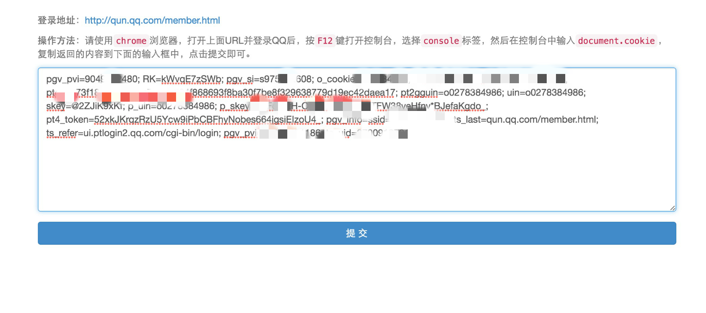
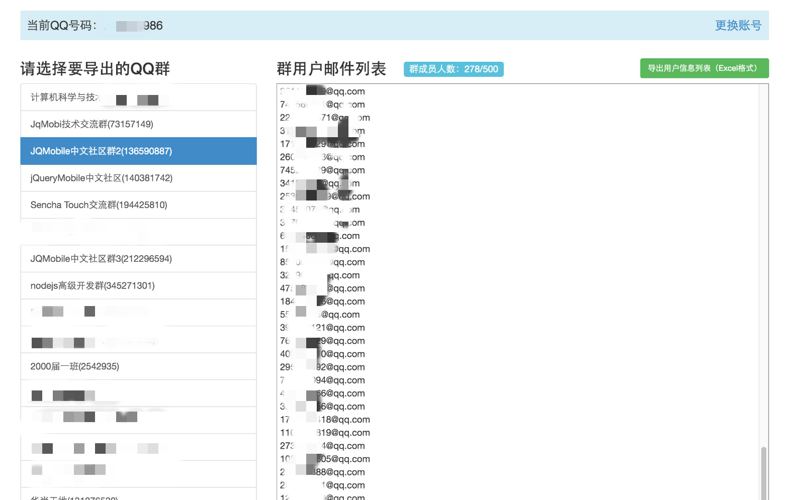
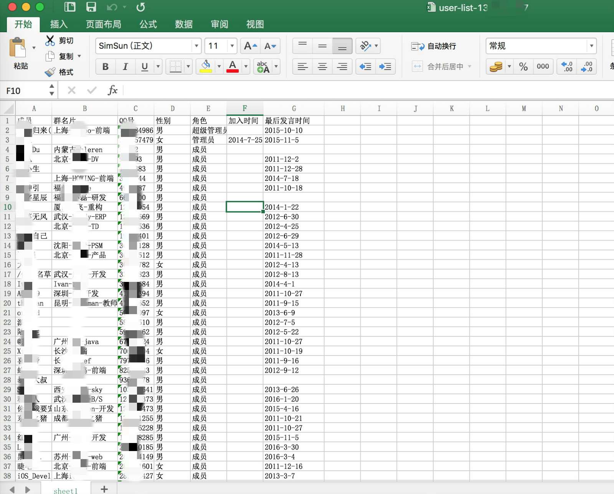

# qq群用户列表提取工具
提取指定 QQ 号码的 QQ 群组用户信息列表及邮箱列表。

## 初始化依赖
```
npm install
```

## 启动方法

```
node index.js
```

访问http://YOUR IP:8000即可，按照页面提示操作即可提取。

## 简要说明
支持文本框直接选择所有邮件列表（用换行分割），直接粘贴到邮箱收件人中即可。

点击`导出用户邮件列表（Excel格式）`将导出excel文件，每条记录包括成员名，群名片，qq号，性别，角色，加入时间，最后发言时间等。

## 相关截图

#### 用户信息输入页

---
#### 用户qq群列表

---
#### excel导出

